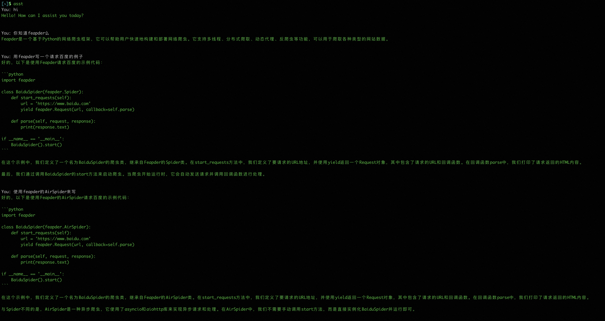
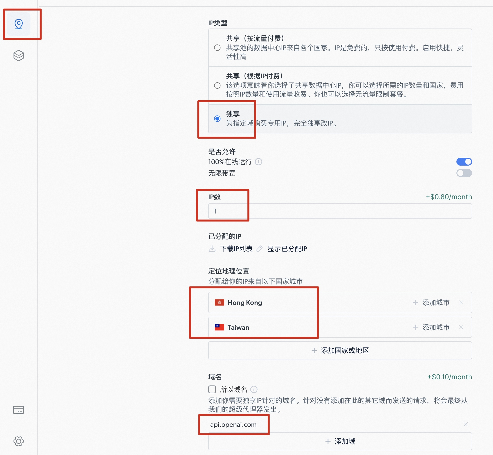
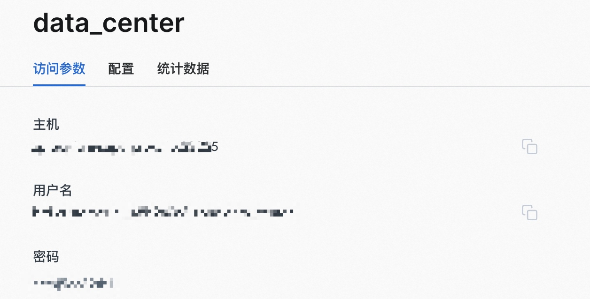

# ChatGPT-CLI
> ChatGPT shell command
> Base on gpt-3.5-turbo

ChatGPT 支持终端命令行啦，基于gpt-3.5-turbo

支持连续对话，在终端输入asst即可开启对话。

如让它写个feapder的爬虫，实际对答如下：



## 安装

```shell
pip install asst
```

## 环境变量

| 变量 | 必须 | 描述 |
| ----|---| ---------------------------------------------------|
| OPENAI_API_KEY| 是 | OpenAI的密钥                                                |
| OPENAI_URL |否 | OpenAI的接口地址，如：https://api.openai.com/v1/chat/completions |
| ASST_PROXY| 否 |代理，如 username:password@ip:port                               |


## 配置

> 没有OPENAI_API_KEY，可联系微信 boris_tm

设置`OPENAI_API_KEY="chatgpt的密钥"`到环境变量

**mac或linux下**
临时设置的方式
```
export OPENAI_API_KEY=your key
```
永久设置
```
vim ~/.bash_profile

# 在合适的位置添加环境变量
export OPENAI_API_KEY="your key"
```

**window下设置为系统环境变量**

参考：<a href="https://blog.csdn.net/xue_nuo/article/details/114793534" target="_blank">https://blog.csdn.net/xue_nuo/article/details/114793534</a>

## 使用

```shell
> asst
You: hello
Bot: Hi there!
```

## 请求超时

国内用户因为墙的原因，无法直接访问chatgpt，需使用魔法。如vpn或代理

代理使用方式：

设置`ASST_PROXY="代理"`到环境变量

如：

```
export ASST_PROXY="username:password@ip:port"
```

## 境外代理举例

**推荐：brightdata**

不需要公司、不需要实名，准备好邮箱即可

地址：<a href="https://brightdata.grsm.io/r0g6zla8seqs" target="_blank">https://brightdata.grsm.io/r0g6zla8seqs</a>

若提示认证，选择支付宝即可，并不需要真正的认证

充值支持支付宝

使用方式：

1. 选择机房代理，因为便宜。追求稳定选择住宅

    
    
2. 配置：

    
    
3. 查看访问参数



4. 配置代理

    设置`ASST_PROXY="代理"`到环境变量
    
    如：
    
    ```
    export ASST_PROXY="用户名:密码@主机"
    ```

## OPENAI_API_KEY

<font color="red"> 没有OPENAI_API_KEY，可联系微信 boris_tm</font>


